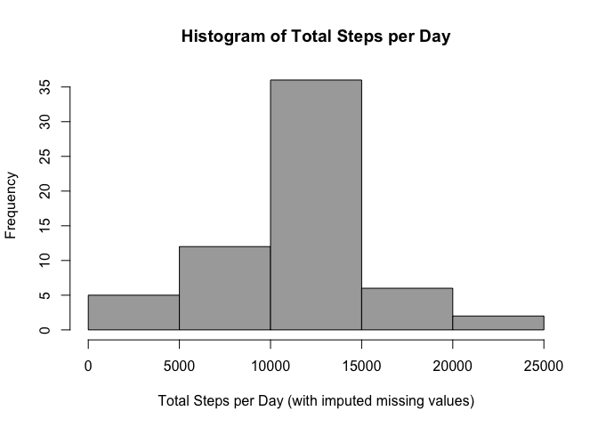
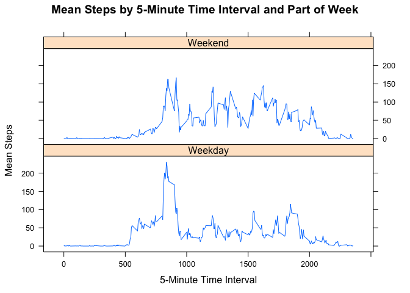

# Reproducible Research: Peer Assessment 1
John Price  

***

#### NOTE: *PNG image files are stored in the following directory*

> PA1_template_files/figure-html/

## Set options and load packages


```r
# Adjust options to prevent scientific notation of mean and median values
options(scipen = 5)

# Load needed packages
library(dplyr)
library(mice)
library(lattice)
```

## Part 1: Loading and preprocessing the data


```r
# Download data if needed
if(!file.exists("activity.zip")) {
  file_url <- "https://d396qusza40orc.cloudfront.net/repdata%2Fdata%2Factivity.zip"
  download.file(file_url, destfile = "activity.zip", method = "auto")
}

# Unzip download if needed
if(!file.exists("activity.csv")) {
    unzip(zipfile = "activity.zip")
}

# Import data
activity <- read.csv(file = "activity.csv",
                     colClasses = c("integer", "Date", "integer"))
```

***

## Part 2: What is mean total number of steps taken per day?

```r
# Summarize data by day
part2 <- activity %>%
  group_by(date) %>%
  summarize(total_steps = sum(steps, na.rm = TRUE))

# Produce histogram
hist(part2$total_steps,
     col = "darkgray",
     main = "Histogram of Total Steps per Day",
     xlab = "Total Steps per Day")
```


#### Number of steps taken per day (ignoring missing values)

* Mean = 9354.23
* Median = 10395

***

## Part 3: What is the average daily activity pattern?

```r
# Summarize data by 5-minute interval
part3 <- activity %>%
  group_by(interval) %>%
  summarize(mean_steps = mean(steps, na.rm = TRUE))

# Produce line plot
with(part3, plot(interval, mean_steps,
                 type = "l",
                 main = "Mean Steps by 5-Minute Time Interval",
                 xlab = "5-Minute Time Interval",
                 ylab = "Mean Steps"))
```


```r
# Find interval with max mean steps
part3[which.max(part3$mean_steps), ]
```

```
## Source: local data frame [1 x 2]
## 
##   interval mean_steps
##      (int)      (dbl)
## 1      835   206.1698
```

On average across all days, the 835th 5-minute time interval has the maximum number of steps with a mean of around 206 steps.

***

## Part 4: Imputing missing values

The MICE package has a function, *md.pattern*, that can analyze the missing values in a data frame. The results shows all of the missing values are found in the *steps* variable. There are 2,304 missing step values in the original dataset.


```r
# Use MICE package to analyze missing values
md.pattern(activity)
```

```
##       date interval steps     
## 15264    1        1     1    0
##  2304    1        1     0    1
##          0        0  2304 2304
```

To impute a value for a missing number of steps I used the mean number of steps for the same 5-minute time interval across all days rounded to the nearest integer.


```r
# Create new activity dataset with imputted values for missing steps
activity_2 <- activity %>%
  group_by(interval) %>%
  mutate(steps_fill = ifelse(is.na(steps), round(mean(steps, na.rm = TRUE)), steps))
```


```r
# Summarize total steps by day
part4 <- activity_2 %>%
  group_by(date) %>%
  summarize(total_steps = sum(steps_fill, na.rm = FALSE))

# Create histogram of total steps per day
hist(part4$total_steps,
     col = "darkgray",
     main = "Histogram of Total Steps per Day",
     xlab = "Total Steps per Day (with imputed missing values)")
```



#### Number of steps taken per day (with imputted missing values)

* Mean = 10765.64
* Median = 10762

By imputting missing number of steps in the original dataset, we can see an increase in both mean and median number of steps per day. The imputted values have increased the total number of steps per day, which can also be seen in the histogram compared to the histogram in Part 2.

***

## Part 5: Are there differences in activity patterns between weekdays and weekends?


```r
# Function to return part of week from a date
dt_func <- function(dt) {
  if(weekdays(dt) %in% c("Saturday", "Sunday")) {
    return("Weekend")
  }
  else {
    return("Weekday")
  }
}

# Add part of week factor variable
activity_2$week_part <- factor(sapply(activity$date, FUN = dt_func))
```


```r
# Summarize mean steps by part of week and interval
part5 <- activity_2 %>%
  group_by(week_part, interval) %>%
  summarize(mean_steps = mean(steps_fill, nq.rm = FALSE))

# Create line plots
with(part5, xyplot(mean_steps ~ interval | week_part,
                   layout = c(1, 2),
                   type = "l",
                   main = "Mean Steps by 5-Minute Time Interval and Part of Week",
                   xlab = "5-Minute Time Interval",
                   ylab = "Mean Steps"))
```



The line plots shows the number of steps is more spread out during the day for days falling on the weekend as opposed to days during the week.
