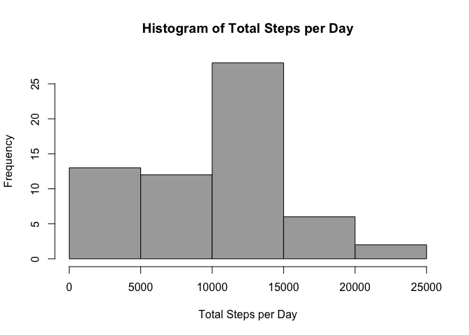
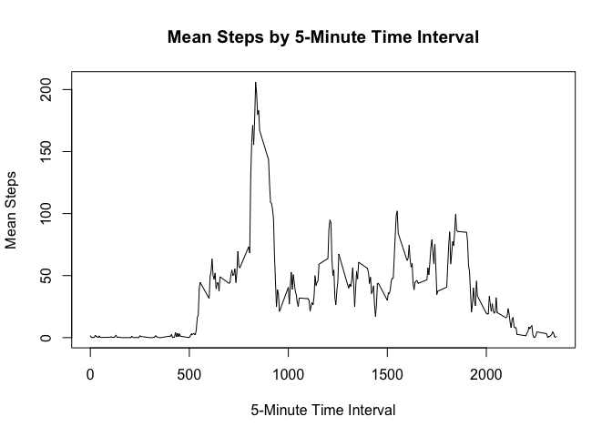
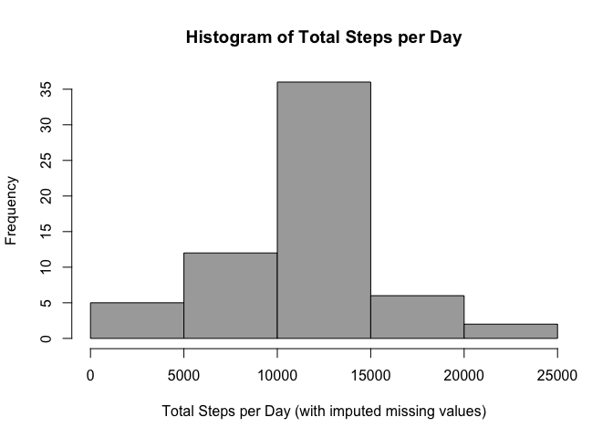

# Reproducible Research: Peer Assessment 1


```r
# Load needed libraries
library(dplyr, warn.conflicts = FALSE)
library(mice, quietly = TRUE)
```

```
## mice 2.25 2015-11-09
```

```r
library(lattice)
```

## Part 1: Loading and preprocessing the data


```r
# Download data if needed
if(!file.exists("activity.zip")) {
  file_url <- "https://d396qusza40orc.cloudfront.net/repdata%2Fdata%2Factivity.zip"
  download.file(file_url, destfile = "activity.zip", method = "auto")
}

# Unzip download if needed
if(!file.exists("activity.csv")) {
    unzip(zipfile = "activity.zip")
}

# Import data
activity <- read.csv(file = "activity.csv",
                     colClasses = c("integer", "Date", "integer"))

# Classify each date as weekend/weekday
dt_func <- function(dt) {
  if(weekdays(dt) %in% c("Saturday", "Sunday")) {
    return("Weekend")
  }
  else {
    return("Weekday")
  }
}
activity$week_part <- factor(sapply(activity$date, FUN = dt_func))
rm(dt_func)
```

## Part 2: What is mean total number of steps taken per day?

```r
part2 <- activity %>%
  group_by(date) %>%
  summarize(total_steps = sum(steps, na.rm = TRUE))

hist(part2$total_steps,
     col = "darkgray",
     main = "Histogram of Total Steps per Day",
     xlab = "Total Steps per Day")
```



## Part 3: What is the average daily activity pattern?

```r
part3 <- activity %>%
  group_by(interval) %>%
  summarize(mean_steps = mean(steps, na.rm = TRUE))

with(part3, plot(interval, mean_steps,
                 type = "l",
                 main = "Mean Steps by 5-Minute Time Interval",
                 xlab = "5-Minute Time Interval",
                 ylab = "Mean Steps"))
```



## Part 4: Imputing missing values

```r
md.pattern(activity)
```

```
##       date interval week_part steps     
## 15264    1        1         1     1    0
##  2304    1        1         1     0    1
##          0        0         0  2304 2304
```

```r
activity_2 <- activity %>%
  group_by(interval) %>%
  mutate(steps_fill = ifelse(is.na(steps), round(mean(steps, na.rm = TRUE)), steps))
```

```r
part4 <- activity_2 %>%
  group_by(date) %>%
  summarize(total_steps = sum(steps_fill, na.rm = TRUE))

hist(part4$total_steps,
     col = "darkgray",
     main = "Histogram of Total Steps per Day",
     xlab = "Total Steps per Day (with imputed missing values)")
```



## Part 5: Are there differences in activity patterns between weekdays and weekends?
